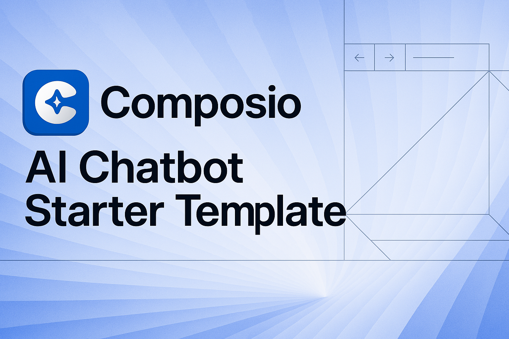

<a href="https://composio.dev">
  
  <h1 align="center">Composio AI Chatbot Template</h1>
</a>

<p align="center">
  An Open-Source AI Chatbot Template Built With Next.js and the AI SDK by Vercel.
</p>

<p align="center">
  <a href="#features"><strong>Features</strong></a> ·
  <a href="#deploy-your-own"><strong>Deploy Your Own</strong></a> ·
  <a href="#running-locally"><strong>Running locally</strong></a>
</p>
<br/>

## Features

- [Composio + AI SDK](https://docs.composio.dev/frameworks/vercel) 
  - Composio for providing tools across 300+ apps.
  - Managed authentication for secure user connections.
  - Unified API for generating text, structured objects, and tool calls with LLMs
- [Braintrust](https://braintrust.dev)
  - Advanced observability and monitoring for your AI apps.
- [shadcn/ui](https://ui.shadcn.com)
  - Styling with [Tailwind CSS](https://tailwindcss.com)
  - Component primitives from [Radix UI](https://radix-ui.com) for accessibility and flexibility
- Data Persistence
  - [Vercel Postgres powered by Neon](https://vercel.com/storage/postgres) for saving chat history and user data
  - [Vercel Blob](https://vercel.com/storage/blob) for efficient file storage
- [NextAuth.js](https://github.com/nextauthjs/next-auth)
  - Simple and secure authentication

## What does it do?
This template showcases how to use Composio and the AI SDK to build an AI chatbot with access to third-party APIs (like Gmail, Google Calendar) as tools.
Composio manages connections to third-party APIs and handles the authentication flow for the users.

It also uses Braintrust for observability and monitoring.

## Get Started

1. Clone this repository
2. Install dependencies: `pnpm install`
3. Create a Composio account and get a Composio API key from [Composio](https://app.composio.dev/developers). Save it in the `.env`
4. Create an integration for Google Calendar and Gmail in Composio.
5. Save the integration IDs in the `.env` file
6. Run the development server: `pnpm run dev`

## Running locally

You will need to use the environment variables [defined in `.env.example`](.env.example) to run Next.js AI Chatbot. It's recommended you use [Vercel Environment Variables](https://vercel.com/docs/projects/environment-variables) for this, but a `.env` file is all that is necessary.

> Note: You should not commit your `.env` file or it will expose secrets that will allow others to control access to your various AI and authentication provider accounts.

1. Install Vercel CLI: `npm i -g vercel`
2. Link local instance with Vercel and GitHub accounts (creates `.vercel` directory): `vercel link`
3. Download your environment variables: `vercel env pull`

```bash
pnpm install
pnpm dev
```

Your app template should now be running on [localhost:3000](http://localhost:3000/).
